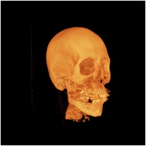
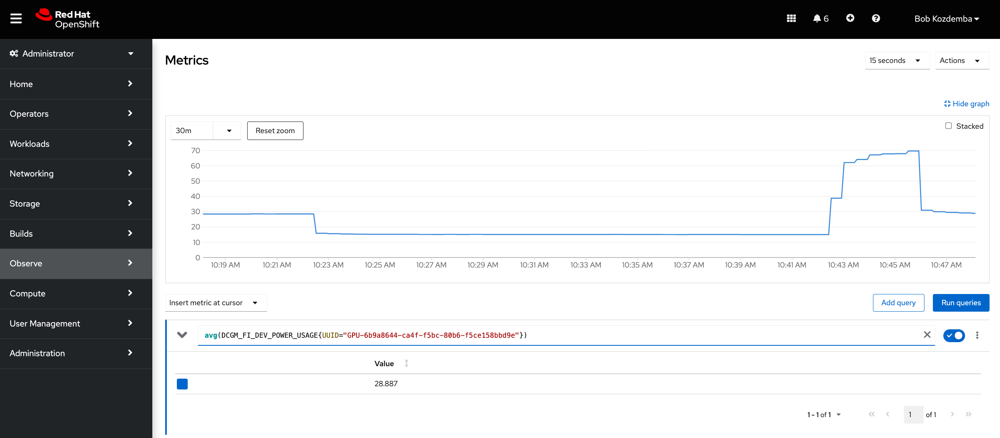

:scrollbar:
:data-uri:
:toc2:
:linkattrs:

= Red Hat GPU Workshop 

:numbered:

== Overview
A workshop focused on using NVIDIA GPUs on Red Hat platforms. 

== Background

Graphics Processing Units (GPUs) were originally invented to allow application developers to program 3D graphics accelerators 
to render photo realistic images in real time. The key is GPUs accelerate matrix and vector math 
operations (dot product, cross product and matrix multiplies). It turns out these math operations are used in many applications 
besides 3D graphics including high performance computing and machine learning. As a result, software libraries (i.e. CUDA) 
were developed to allow non-graphics or general purpose computing applications to take advantage of GPU hardware.

[.float-group]
--
[.left]
.Fixed


[.left]
.Programmable

--

GPUs provide a programable graphics pipeline for realistic image rendering.

== RHEL 9.1

The following NVIDIA® software is required for GPU support.
```

NVIDIA® GPU drivers version 450.80.02 or higher.
CUDA® Toolkit 11.2.
cuDNN SDK 8.1.0.
(Optional) TensorRT to improve latency and throughput for inference.
```

The easy way to install the NVIDIA stack is to use the link:ansible/vm/README.adoc[Ansible based provisioning].

Once the stack is built, running the `nvidia-smi` utility will cause the kernel modules to load and will verify the driver installation.
```
nvidia-smi
```

Example output:
```
+-----------------------------------------------------------------------------+
| NVIDIA-SMI 510.47.03    Driver Version: 510.47.03    CUDA Version: 11.6     |
|-------------------------------+----------------------+----------------------+
| GPU  Name        Persistence-M| Bus-Id        Disp.A | Volatile Uncorr. ECC |
| Fan  Temp  Perf  Pwr:Usage/Cap|         Memory-Usage | GPU-Util  Compute M. |
|                               |                      |               MIG M. |
|===============================+======================+======================|
|   0  Tesla T4            Off  | 00000000:00:1E.0 Off |                    0 |
| N/A   37C    P0    26W /  70W |      0MiB / 15360MiB |     10%      Default |
|                               |                      |                  N/A |
+-------------------------------+----------------------+----------------------+
                                                                               
+-----------------------------------------------------------------------------+
| Processes:                                                                  |
|  GPU   GI   CI        PID   Type   Process name                  GPU Memory |
|        ID   ID                                                   Usage      |
|=============================================================================|
|  No running processes found                                                 |
+-----------------------------------------------------------------------------+
```

==== RHEL Testing

###### Non-container app test

Now the system should be ready to run a gpu workload. Run a simple test to validate the software stack.

Create a python environment and install tensorflow.
```
python3 -m venv venv
source venv/bin/activate
pip install pip tensorflow -U
```

Run a simple tensorflow test to confirm a GPU device is found.
```
ipython

>>> import tensorflow as tf

>>> tf.config.list_logical_devices()
```

Sample output.
```
Created device /job:localhost/replica:0/task:0/device:GPU:0 with 14644 MB 
memory:  -> device: 0, name: Tesla T4, pci bus id: 0001:00:00.0, compute capability: 7.5

[LogicalDevice(name='/device:CPU:0', device_type='CPU'),
 LogicalDevice(name='/device:GPU:0', device_type='GPU')]
```

Run the script to test the tensorflow devices.
```
python src/tf-test.py
```

Compare the CPU vs. GPU elapsed time in the output.
```
[PhysicalDevice(name='/physical_device:CPU:0', device_type='CPU'), PhysicalDevice(name='/physical_device:GPU:0', device_type='GPU')]
Matrix Multiply Elapsed Time: {'CPU': 6.495161056518555, 'GPU': 0.9890825748443604}
```

== Additional RHEL Demos

=== CUDA Demo
```
cd /usr/local/cuda-11.8/extras/demo_suite
./nbody -benchmark -cpu
./nbody -benchmark
```

=== Container Demos

==== For RHEL8.x, install the link:https://docs.nvidia.com/datacenter/cloud-native/container-toolkit/install-guide.html#podman[NVIDIA container toolkit].

==== For RHEL9.x, link:https://blog.shawonashraf.com/nvidia-podman-fedora-37[follow this blog post] to 
install the NVIDIA container toolkit.

=== Containerized app test

The `nvidia-smi` output should be similar to what was reported above.

```
podman run --rm --security-opt=label=disable --hooks-dir=/usr/share/containers/oci/hooks.d/ nvcr.io/nvidia/cuda:11.3.0-devel-ubi8 nvidia-smi
```

== Openshift

=== Install
The easy way to install the NVIDIA stack is to use the link:ansible/ocp/README.adoc[Ansible based provisioning]

Wait for all the pods to have a completed or running status. This could take several minutes.

```
oc get pods -n nvidia-gpu-operator
```

The daemonset pods will build a driver for each node with a GPU.

```
oc logs nvidia-driver-daemonset-410.84.202204112301-0-gf4t4  -n nvidia-gpu-operator  nvidia-driver-ctr --follow

Tue May 17 19:41:23 UTC 2022 Waiting for openshift-driver-toolkit-ctr container to build the precompiled driver ...
```

Check the logs from one of the `nvidia-cuda-validator` pods.

```
oc logs -n nvidia-gpu-operator nvidia-cuda-validator-qpqcg


cuda workload validation is successful
```

=== GPU Test

. Determine the id of the `gputest` pod:
+
-----
$ POD=$(oc get pods --selector=deploymentconfig=gputest -n gputest --output=custom-columns=:.metadata.name --no-headers)
-----

. Connect to the tensorflow pod:
+
-----
$ oc rsh ${POD} bash
-----

. Install the `tensorflow` module:
+
-----
$ pip install tensorflow
-----

. Install `matplotlib`:
+
-----
$ pip install matplotlib
-----


. Run a quick GPU test:

.. Switch to the `python` interpreter:
+
-----
$ python


Python 3.8.10 (default, Mar 15 2022, 12:22:08) 
[GCC 9.4.0] on linux
-----

. At the python command line, import tensorflow and list physical devices:
+
-----
>>> import tensorflow as tf
>>> tf.config.list_physical_devices()
[PhysicalDevice(name='/physical_device:CPU:0', device_type='CPU'), PhysicalDevice(name='/physical_device:GPU:0', device_type='GPU')]
-----

. Exit out of the python shell:
+
-----
>>> exit()
$
-----


=== Jupyter Lab Web App

. Determine route to `GPU Test` web app:
+
-----
$ echo -en "\nhttp://$(oc get route gputest --template={{.spec.host}} -n gputest)\n"
-----

. In a new tab of your browser, navigate to the URL returned in the above command.


. Determine the `token` needed to authenticate into the jupyter web app:
+
From the log file of the pod, pick out the token:
+
-----
$ oc logs ${POD} -n gputest | grep "token=" | head -n 1 | cut -d "=" -f2
-----

. Use the token to authenticate into the Jupyter Lab web app.

. In Jupyter lab, clone the link:https://github.com/tensorflow/docs.git[tensorflow docs] examples and run the notebook at:  `docs/site/en/tutorials/keras/classification.ipynb`

.. Error:
+
-----
2023-01-24 19:44:26.632828: I tensorflow/core/platform/cpu_feature_guard.cc:193] This TensorFlow binary is optimized with oneAPI Deep Neural Network Library (oneDNN) to use the following CPU instructions in performance-critical operations:  AVX2 AVX512F AVX512_VNNI FMA
To enable them in other operations, rebuild TensorFlow with the appropriate compiler flags.
2023-01-24 19:44:26.776592: I tensorflow/core/util/port.cc:104] oneDNN custom operations are on. You may see slightly different numerical results due to floating-point round-off errors from different computation orders. To turn them off, set the environment variable `TF_ENABLE_ONEDNN_OPTS=0`.
2023-01-24 19:44:27.622397: W tensorflow/compiler/xla/stream_executor/platform/default/dso_loader.cc:64] Could not load dynamic library 'libnvinfer.so.7'; dlerror: libnvinfer.so.7: cannot open shared object file: No such file or directory; LD_LIBRARY_PATH: /usr/local/nvidia/lib:/usr/local/nvidia/lib64
2023-01-24 19:44:27.622486: W tensorflow/compiler/xla/stream_executor/platform/default/dso_loader.cc:64] Could not load dynamic library 'libnvinfer_plugin.so.7'; dlerror: libnvinfer_plugin.so.7: cannot open shared object file: No such file or directory; LD_LIBRARY_PATH: /usr/local/nvidia/lib:/usr/local/nvidia/lib64
2023-01-24 19:44:27.622497: W tensorflow/compiler/tf2tensorrt/utils/py_utils.cc:38] TF-TRT Warning: Cannot dlopen some TensorRT libraries. If you would like to use Nvidia GPU with TensorRT, please make sure the missing libraries mentioned above are installed properly.
-----

.. There doesn't seem to be a `tensorRT` image in quay.io/modh/cuda-notebooks.
+
TensorRT packages found link:https://developer.nvidia.com/nvidia-tensorrt-7x-download[here].


##### Jupyter/Tensorflow Example

- Visit the ${ROUTE} from above.
- Use the token to login to Jupyter.
- Open the `tensorflow-tutorials/classification.ipynb` notebook.
- Run all of the cells.
- It should train, test and validate a machine learning model.

=== GPU Dashboard (OCP v4.11+)

Install the GPU console plugin dashboard by following the link:https://docs.openshift.com/container-platform/4.11/monitoring/nvidia-gpu-admin-dashboard.html[Openshift documentation]

=== OpenDataHub (optional)

Create a new project for OpenDataHub.

Using the Openshift web console, create an instance of the ODH operator in this project.

Create an ODH instance in your namespace.

Create the CUDA enabled notebook image streams.
```
oc apply -f https://raw.githubusercontent.com/red-hat-data-services/odh-manifests/master/jupyterhub/notebook-images/overlays/additional/tensorflow-notebook-imagestream.yaml 
```

##### Custom Notebook Limits (Optional)

Configmaps are used to set custom notebook resource limits such as number of cpu cores,
memory and GPUs. This is necessary for the jupyter pod to get scheduled
on a GPU node. 

Apply the following configmap before the launching jupyterhub server.
```
oc apply -f src/jupyterhub-notebook-sizes.yml
```

From within Jupyter, clone the following repo:

link:https://github.com/tensorflow/docs.git[Tensor Flow Examples]

These tensorflow notebook examples should run:

- `docs/site/en/tutorials/keras/classification.ipynb`
- `docs/site/en/tutorials/quickstart/beginner.ipynb`
- `docs/site/en/tutorials/quickstart/advanced.ipynb`

== DIY Grafana GPU Dashboard
```
oc create token grafana-serviceaccount --duration=2000h -n models
```

Edit `grafana-data-source.yaml` (replace <namespace> and <service-account-token>)
```
oc create -f grafana-data-source.yaml
```

Import the sample [DCGM exporter dashboard](https://grafana.com/grafana/dashboards/12239-nvidia-dcgm-exporter-dashboard/) (`grafana/NVIDIA_DCGM_Exporter_Dashboard.json`)



