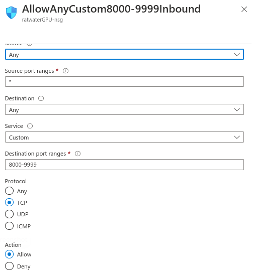

:scrollbar:
:data-uri:
:toc2:
:linkattrs:

= GPU Workshop Ansible:  VM

:numbered:

== Purpose
The purpose of this ansible is to automate & document the configuration of a RHEL 9 virtual machine to support GPU enabled data science tasks.


This workshop is based on using the precompiled
nvidia drivers that match a specific Red Hat kernel release.

== Pre-reqs

. *ansible*
+
Ansible needs to be installed.  On Fedora/RHEL based systems, ansible can be installed either via DNF or via Python pip.  Choose one of the following

.. *DNF* install:

... Ansible needs to be installed on the local host machine. ie:
+
-----
# dnf install ansible
-----

... In addition, the link:https://docs.ansible.com/ansible/latest/collections/ansible/posix/firewalld_module.html[ansible-posix collection] is also needed. ie:
+
-----
# dnf install ansible-collection-ansible-posix.noarch
-----

.. *Python pip* install:

... Create the `inventory` file and set the user name.
+
```
[local]
localhost ansible_connection=ssh  ansible_user=<change-me>
```

... Create a python virtual environment.
+
```
$ python -m venv ~/venv
$ source ~/venv/bin/activate
$ pip install pip ansible -Uq
```

. *RHEL9 virtual machine*
+
The target RHEL9 GPU enabled virtual machine needs to be configured with the following:

.. *Operating system user*
+
Operating system user needs to be enabled with ability to sudo.
+
In addition, ssh access via public/private keys needs to be enabled for this user.

.. *Subscription-Manager*
+
All VMs need to already have access to base RHEL 9 dnf/yum repositories.

.. *Storage*
+
The NVIDIA drivers that are installed (as part of this ansible) require at least 20GB allocated to the `/` filesystem.

.. *GPU*
+
Refer to one of the following:

.. <<GPU enabled Azure VM>>
.. <<GPU enabled AWS VM>>

== Procedure

. Clone this git project to your local disk and change into this directory.
+
-----
$ cd ansible/vm
-----

. Copy `inventory.example` :
+
-----
$ cp inventory.example inventory
-----
+
Make changes to `inventory` file as needed.
+
Pay particular attention to `changeme` configs.

. Execute:

.. Utilize defaults:
+
-----
$ ansible-playbook -i inventory vm_update.yml
-----

.. Optional: Specify different versions of Cuda:

... Cuda library versions for RHEL 8 can be found link:https://developer.download.nvidia.com/compute/cuda/repos/rhel8/x86_64/[here].
... Cuda library versions for RHEL 9 can be found link:https://developer.download.nvidia.com/compute/cuda/repos/rhel9/x86_64/[here]

... Execute:
+
-----
$ ansible-playbook -i inventory vm_update.yml \
    -e cuda_version=11-8
-----

== Post-Install Verify

. View version of kernel module that NVIDIA driver is reporting:
+
-----
$ cat /proc/driver/nvidia/version
-----
+
You should see a response similar to the following:
+
-----
NVRM version: NVIDIA UNIX x86_64 Kernel Module  515.86.01  Wed Oct 26 09:12:38 UTC 2022
GCC version:  gcc version 11.3.1 20220421 (Red Hat 11.3.1-2) (GCC)
-----

. View list of NVIDIA related kernel modules:
+
-----
$ lsmod | grep -i nvidia
-----
+
You should see a response similar to the following:
+
-----
nvidia_drm             73728  0
nvidia_modeset       1150976  1 nvidia_drm
nvidia_uvm           1351680  0
nvidia              40882176  2 nvidia_uvm,nvidia_modeset
drm_kms_helper        200704  4 hyperv_drm,nvidia_drm
drm                   622592  6 drm_kms_helper,drm_shmem_helper,nvidia,hyperv_drm,nvidia_drm
-----

== Appendix

=== docker-compose

. Enable the podman socket for your operating system user (ie:  _azureuser_ )
+
-----
$ systemctl --user enable podman.socket \
    && systemctl --user start podman.socket \
    && systemctl --user status podman.socket
-----

. Add a shell environment variable that specifies where to connect to docker/podman:
+
-----
$ echo -en "\nexport DOCKER_HOST=unix:///run/user/$UID/podman/podman.sock" >> $HOME/.bashrc \
    && source $HOME/.bashrc
-----

. Install docker-compose
+
-----
$ pip3 install docker-compose
-----

=== GPU enabled AWS VM

. AWS Blank Open Environment

=== GPU enabled Azure VM
This section documentes how a member of the Red Hat Sales organization can obtain & configure a GPU enabled virtual machine from Azure.

==== Blank Subscription

. Order a `Blank` Azure Subscription via `demo.redhat.com`

.. Authenticate into `demo.redhat.com`.
.. Navigate to: `Catalog` and search for: `Azure`
.. Select: `Azure Subscription Based Blank Open Environment`
+
With this environment, you will be provided access to a Microsoft account.
This account will be temporarily granted `Contributor` access to a subscription from a pool.
As a `Contributor`, you'll have the ability to request for quota allocation for a GPU enabled environment.
+
NOTE:  There is a similar option called:  `Azure Blank Open Environment`.
Do not to select this!  It will not allow you to request a GPU enabled virtual machine.

.. Click: `Order` and fill-out the order form.

. Once provisioning is completed, demo.redhat.com will publish details of the new subscription based blank open environment.

. Navigate to `portal.azure.com` and authenticate using your Red Hat kerberos credentials.

. Verify domain

.. Click your profile avatar in the top right corner and navigate to: `Switch directory -> Directories -> All Directories.

.. You should see that you are associated with `redhat.com` _Directory_ that includes the _domain_: `redhat0.onmicrosoft.com`.
+


.. If not, switch to this directory.

==== GPU Series

For the purpose of this workshop, a link:https://learn.microsoft.com/en-us/azure/virtual-machines/nct4-v3-series[NCASv3-series] GPU enabled VM will be utilized.

This offering provides a GPU with the following specs:

-----
        "+---------------------------------------------------------------------------------------+",
        "| NVIDIA-SMI 530.30.02              Driver Version: 530.30.02    CUDA Version: 12.1     |",
        "|-----------------------------------------+----------------------+----------------------+",
        "| GPU  Name                  Persistence-M| Bus-Id        Disp.A | Volatile Uncorr. ECC |",
        "| Fan  Temp  Perf            Pwr:Usage/Cap|         Memory-Usage | GPU-Util  Compute M. |",
        "|                                         |                      |               MIG M. |",
        "|=========================================+======================+======================|",
        "|   0  Tesla T4                        Off| 00000001:00:00.0 Off |                  Off |",
        "| N/A   53C    P0               29W /  70W|      2MiB / 16384MiB |      7%      Default |",
        "|                                         |                      |                  N/A |",
        "+-----------------------------------------+----------------------+----------------------+",

-----

==== Quota Increase

. In the left panel of _portal.azure.com_, navigate to `All services -> Quotas -> Compute`

. Request an increase of 8 units for the _Standard NCASv3_T4 Family_ of CPU/GPU sizes in your desired region:
+


. After some time, microsoft should approve your request for quota increase to 8 units:

.. You should receive an email from Microsoft acknowledging your initial request for quota increase.
.. The _My quotas_ page includes a `refresh` link that you can use to periodically check status.

==== Create a VM:

.. Click:  `Create a Resource -> Virtual Machine -> Create`

.. Complete the form as follows:

... *Resource group*: select from the resource group (created by RHPDS) from the drop-down
... *Virtual machine name*:  provide a unique name
... *Select a Region*:
+
Specify the region that you previously selected to request increased quota for:  `Standard_NC4as_T4_v3 - 4 vcpus,28 GiB memory`

... *Image*:
+
Choose one of the following:

.... _Red Hat Enterprise Linux 9.1 (LVM) - x64 Gen 2_
.... _Red Hat Enterprise Linux 8.6 (LVM) - x64 Gen 2_
+
NOTE: The implication of the major version of OS is the CUDA library versions made available by NVIDIA:
The Cuda library versions for RHEL 8 can be found link:https://developer.download.nvidia.com/compute/cuda/repos/rhel8/x86_64/[here].
The Cuda library versions for RHEL 9 can be found link:https://developer.download.nvidia.com/compute/cuda/repos/rhel9/x86_64/[here].


... *Size*: Standard_NCAS_v3_T4 - 4 vcpus,28 GiB memory 

... *Username*: azureuser

... *SSH public key source*: Either generate a new key pair or upload an existing public key

. Click `Review + Create`

==== Confirm GPU

. SSH into the VM as `azureuser`
. Execute:
+
-----
$ sudo lshw -C display
-----
+
Results should be similar to the following:
+
-----
  *-display                 
       description: 3D controller
       product: TU104GL [Tesla T4]
       vendor: NVIDIA Corporation
       physical id: 1

  ...
-----

. Verify you have a `CUDA` capable GPU.  Execute:
+
-----
$ lspci | grep -i nvidia
-----

==== Resize VM

The `/` root partition is initially set at: 2.0 GBs.  This will not be sufficient to support any data-science related use-cases.

This partition can be expanded as follows:

. SSH into the VM as `azureuser`
. Execute: `lsblk`
+
Notice that the sda4 device is under-utilized.  There is opportunity to expand the `/` filesystem with-out the need to acquire an additional disk.

. View details of `root` logical volume:
+
-----
$ sudo lvdisplay /dev/rootvg/rootlv
-----

. Extend the size of the `home` logical volume:
+
-----
$ sudo lvextend -L +10G /dev/rootvg/homelv \
    && sudo xfs_growfs /dev/mapper/rootvg-homelv
-----

. Extend the size of the `usr` logical volume:
+
-----
$ sudo lvextend -L +10G /dev/rootvg/usrlv \
    && sudo xfs_growfs /dev/mapper/rootvg-usrlv
-----

. Extend the size of the `var` logical volume:
+
-----
$ sudo lvextend -L +5G /dev/rootvg/varlv \
    && sudo xfs_growfs /dev/mapper/rootvg-varlv
-----

. Extend the size of `root` logical volume to its maximum:
+
-----
$ sudo lvextend -l +100%FREE /dev/rootvg/rootlv \
    && sudo xfs_growfs /dev/mapper/rootvg-rootlv
-----

. Re-execute `lsblk` and notice the new size of the `/` partition


==== Customize Azure Firewall Rules

. In the portal page for your new VM, navigate to `Settings -> Networking`.

. Click `Add inbound port rule` and populate the form as follows:
+


=== TO-DO

==== TensorRT install

. link:https://developer.nvidia.com/nvidia-tensorrt-8x-download[nvidia-tensorrt-8x-download]

. link:https://docs.nvidia.com/deeplearning/tensorrt/install-guide/index.html#installing-rpm[tensorrt rpm]

-----
$ sudo rpm -ivh /u02/downloads/nv-tensorrt-local-repo-rhel8-8.5.1-cuda-11.8-1.0-1.x86_64.rpm

$ sudo dnf install tensorrt-devel tensorrt-libs libnvonnxparsers-devel-8.5.1-1.cuda11.8
-----
